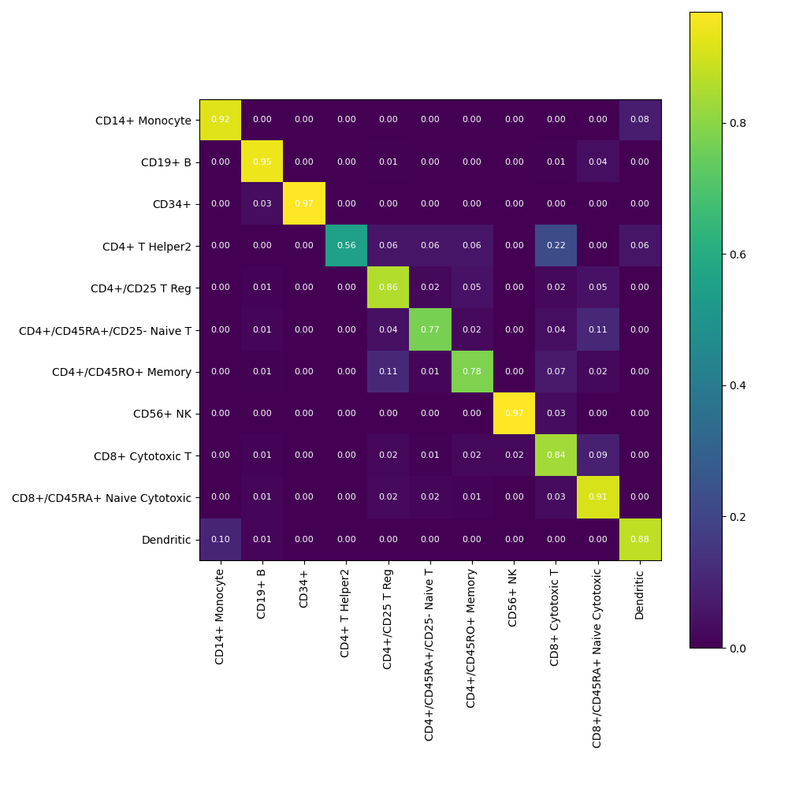

# Genbio interview single cell classification

## Step 1: initial data exploration, training/validation/test split, normalization and transformation

I noticed that the cells.npy matrix contains count data and a large number of zeros, which is common in single cell data. Therefore, I started from the basic preprocessing stips listed in scanpy. I first normalized the count data using scanpy.pp.normalize_total which divides the counts by the total counts for each cell. Then I used scanpy.pp.log1p which log transforms the data with a pseudcount of 1. I then exported this normalized and transformed data into a .npy file for future use in training.

Then I created an approximately 60/20/20 training/validation/test split of the data by randomly sampling cell indexes. I wrote these indexes to .npy file for future use in training. To do some data exploration and plotting, I subsetted the scanpy anndata object to just the training set and ran PCA dimension reduction as well as UMAP for visualization. All these steps were completed using scanpy's inbuilt methods.

I wrote a notebook to run these steps at:
```
data_exploration.ipynb
```

From PCA, we can see that most of the variance in the data is explained by the first few PCs, however, there is still signal as we go to PC100. Therefore, it is important to retain these features when training models.


Further, visualizing the first two dimensions after UMAP reduction gives an indication that there is some clustering in the data based on the cell labels provided in the data.


After confirming the number of PCs needed and that there is some structure to be exploited in the training data that could be used to learn cell type labels, I then moved on to training a model.

## Step 2: training a logistic regression classifier using l1 lasso penalty
Cell types in the human body can be uniquely defined by the differential expression of certain marker genes in the genome. Just having high or low expression of a marker gene can delineate cell types. Therefore, I assumed there would be a good chance that training a linear model which models cell type as a linear function of the gene expression counts could be a reasonable step to start with. Second, only a few genes are likely to be markers and a harsh l1 penalty could be useful to just select the important genes and ignore the rest.

The training script can be found here:
```
train_model.py
```

This script trains a model on the full training set and the full set of count normalized and log1p transformed gene features. The script ran overnight and saved the model weights to a .joblib file. While the training loss didn't completely converge after a 100 iterations over the training set, it was able to reduce the loss significantly and therefore, I looked to evaluate the model on the validation test to estimate the generalization performance.

## Step 3: Evaluating the model
I wrote an evaluation notebook which can be found here:
```
evaluate_model.ipynb
```
Briefly, in this notebook, I load the model .joblib file and make predictions on the validation set cells. I then compare the true cell class labels to the predicted cell class labels. The notebook plots a confusion matrix which shows that we can accurately predict the correct class for majority of the examples for each cell class.


Further, if we plot the accuracy by normalizing the confusion matrix for each row, we can see that it can easily classify cell types like B-cells, CD14+ monocytes, dendritic cells, and CD34+ cells but it runs into issues when classifying a few but not all closely related T cell types. Particularly, the model misclassifies CD4+ T helper cells as CD8+ cytotoxic T cells.



## Things I would try if I had more time:

1. train model on the top 100 or so informative PCs instead of the full cell x gene matrix to speed up training and faciliate easy hyperparameter tuning and architecture exploration
2. compute metrics like auROC and auPRC to get even more information about how the classifier is calibrated and account for class imbalance when computing performance of the model.


3. As we can see from the confusion matrix for the training set, it seems like we are overfitting and able to classify every cell type accurately aside from CD8+ cytotoxic T cells. More regularization of the model will likely help prevent overfitting and lead to even better performance on the validation set. We could do this with a higher weight on the l1 penalty to select even fewer informative featues. Training on the PCs will also likely reduce overfitting since it will capture most of the important variation in the data.